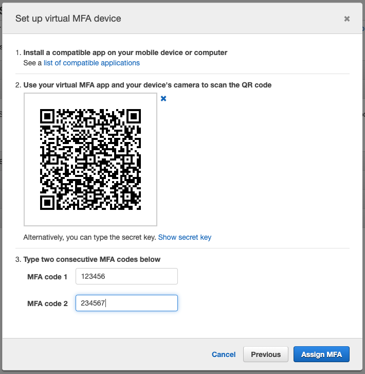
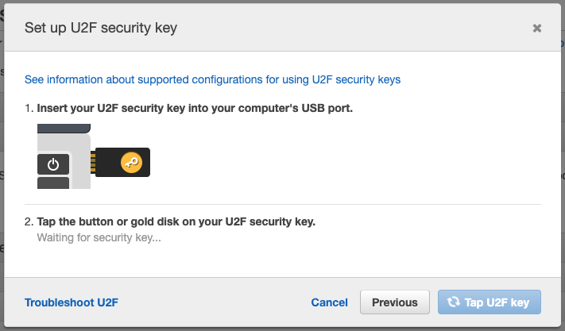
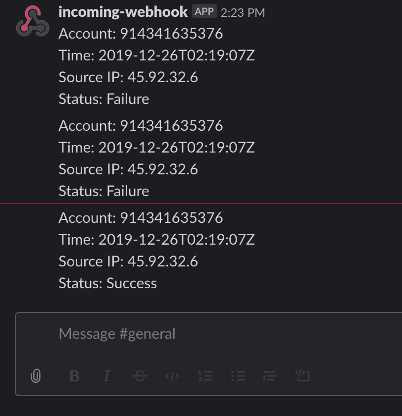

# AWS Root Account Best Practice

## Root Access Key 삭제

1. AWS Management Console에서 좌측 상단에 있는 **[Services]** 를 선택하고 검색창에서 IAM를 검색하거나 **[Security, Identity, & Compliance]** 바로 밑에 있는 **[IAM]** 를 선택

2. IAM Dashboard에서 **[Security Status]** 아래에 Delete your root access keys의 상태가 :warning: 일 경우 계속 진행하고, :white_check_mark: 일 경우 다음 섹션으로 이동.

3. 화면 우측상단 :bell: 오른쪽에 있는 **[사용자 아이디]**  클릭 &rightarrow; **[My Security Credentials]**

4. **[Access keys (access key ID and secret access key)]** 섹션에 있는 엑서스키(들)을 모두 삭제 (**Actions** &rightarrow; **Delete**)

5. IAM Dashboard에서 **[Security Status]** 아래에 Delete your root access keys의 상태가 :white_check_mark: 으로 변경됬는지 확인

## MFA 설정

1. **[My Security Credentials]** Dashboard로 이동 &rightarrow; **[Multi-factor authentication (MFA)]** &rightarrow; **[Activate MFA]**

2. Virtual MFA Device 경우

    

    - [Virtual MFA Applications](https://aws.amazon.com/iam/features/mfa/)를 통해서 모바일 또는 데스크톱에서 사용할 MFA 어플리케이션 다운로드 및 설치

    - 설치 후 QR Code 또는 Secret key를 사용해서 Device 등록

    - 등록 후 Virtual MFA Application에서 표시되는 6자리 번호를 차례대로 입력

3. U2F security key 경우

    

    - U2F 보안키를 USB 포트에 연결

    - U2F 보안키에 금색 부분을 터치

4. 기타 Hardware MFA 경우

    

    - MFA (OTP) 디바이스 일련번호 입력

    - 전원을 키고 나오는 6자리 숫자를 차례대로 입력

5. Root 계정에 활성화된 MFA가 비활성화 될 경우 아래와 같은 안내메일이 Root 계정에 연결된 이메일 주소로 발송합니다.

   ```text
   Greetings from Amazon Web Services.

   As per your request, the multi-factor authentication (MFA) has been deactivated for the AWS account associated with this email address.

   If you did not initiate this action, you can view and update your MFA settings on the My Security Credentials page in the AWS Management Console

   For additional help, visit the AWS Support Center at https://aws.amazon.com/support.

   Thank you for using Amazon Web Services.

   Sincerely,
   The Amazon Web Services Team
   ```

## Root 유저 로그인 Slack 알람 설정

1. 접근 가능한 Slack Workspace 및 해당 Workspace에 대한 Admin 권한을 가지 계정이 필요.

2. Slack workspace에 [Incoming webhook](https://my.slack.com/services/new/incoming-webhook) 설정 - 알람을 받은 채널을 지정하고 Webhook URL 생성

3. AWS Management Console에서 좌측 상단에 있는 **[Services]** 를 선택하고 검색창에서 Lambda를 검색하거나 **[Compute]** 밑에 있는 **[Lambda를]** 를 선택

4. Lambda Dashboard에서  **[Create function]** 클릭후,
  **Function name** = root_login_nofity_slack,
  **Runtime** = Python 3.7,
  **[Create function]** 클릭

5. 아래 코드블록을 Lambda에 복사 후, <SLACK_CHANNEL>, <WEBHOOK_URL>을 위에서 생성한 값으로 변경후 **[Save]** 클릭

    ```python
    import boto3
    import json
    import logging
    import os

    from base64 import b64decode
    from urllib.request import Request, urlopen
    from urllib.error import URLError, HTTPError

    SLACK_CHANNEL = <SLACK_CHANNEL>
    WEBHOOK_URL = <WEBHOOK_URL>

    logger = logging.getLogger()
    logger.setLevel(logging.INFO)


    def lambda_handler(event, context):
        logger.info("Event: " + str(event))

        account_id = event['detail']['userIdentity']['accountId']
        event_time= event['detail']['eventTime']
        source_ip_address = event['detail']['sourceIPAddress']
        status = event['detail']['responseElements']['ConsoleLogin']
        slack_message = {
            'channel': SLACK_CHANNEL,
            'text': "Account: %s \n Time: %s \n Source IP: %s \n Status: %s" % (account_id, event_time, source_ip_address, status)
        }

        req = Request(WEBHOOK_URL, json.dumps(slack_message).encode('utf-8'))
        try:
            response = urlopen(req)
            response.read()
            logger.info("Message posted to %s", slack_message['channel'])
        except HTTPError as e:
            logger.error("Request failed: %d %s", e.code, e.reason)
        except URLError as e:
            logger.error("Server connection failed: %s", e.reason)
    ```

6. AWS Management Console에서 좌측 상단에 있는 **[Services]** 를 선택하고 검색창에서 CloudTrail를 검색하거나 **[Management & Governance]** 바로 밑에 있는 **[CloudTrail]** 를 선택

7. **[Create trail]** &rightarrow; **Trail name** = trail-root-login, **S3 bucket** = <YOUR_INITIAL>-root-test &rightarrow; **[Create]**

8. AWS Management Console에서 좌측 상단에 있는 **[Services]** 를 선택하고 검색창에서 CloudWatch를 검색하거나 **[Management & Governance]** 밑에 있는 **[CloudWatch]** 를 선택

9. CloudWatch Dashboard에서 **[Events]** 섹션 아래에 있는 **[Rules]** &rightarrow; **[Create rule]**

10. 왼쪽 Event Source에서 :white_check_mark: Event Pattern 선택하고 바로 아래 Dropdown 리스트를 클릭 후 **Custom event pattern** 선택 &rightarrow; 아래 JSON 블록 붙여넣기

    ```json
    {
      "detail-type": [
        "AWS Console Sign In via CloudTrail"
      ],
      "detail": {
        "userIdentity": {
          "type": [
            "Root"
          ]
        }
      }
    }
    ```

11. 오른쪽 Targets에서 **[:heavy_plus_sign: Add target]** &rightarrow; **Lambda function** &rightarrow; **Function** = root_login_nofity_slack &rightarrow; **[Configure details]** 

12. **Name** = root_login_detected, **State** = :white_check_mark: Enabled &rightarrow; **[Create rule]**

13. Root 계정으로 로그인 시도 후 테스트

    
